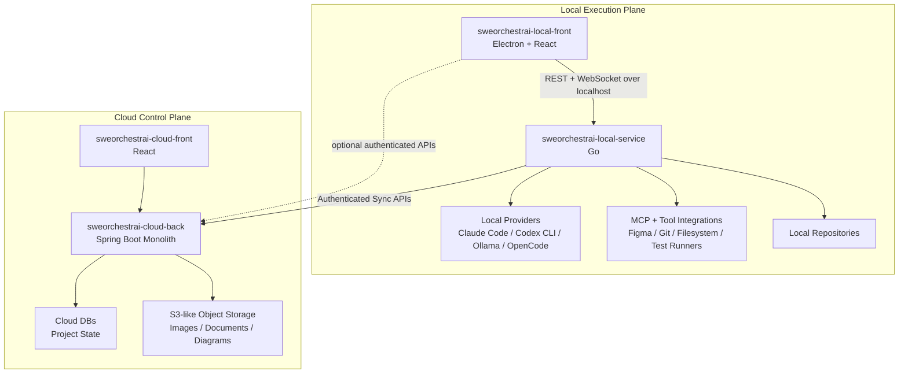

# Architecture Overview

SWEOrchestrAI follows a hybrid architecture:

- **Cloud Control Plane**
- **Local Execution Plane**

The cloud side owns long-lived project state, collaboration, authentication, artifacts, and project management logic.

The local side owns execution inside the user's development environment.



## Core Principle

```text
Cloud = Control Plane
Local = Execution Plane
```

## Key Rules

- The cloud backend should not directly run local coding assistants.
- The cloud backend should not require direct access to local repositories.
- The local service performs work through local tools and providers.
- The cloud frontend provides project management only, not direct AI coding.
- Long-lived project state belongs in the cloud database.
- Binary/project artifacts belong in object storage.
