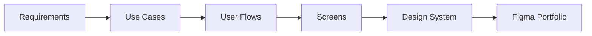

# Design Stage

The design stage is a first-class part of SWEOrchestrAI, not a secondary feature.

It should be driven by requirements and use cases.

## Intended Capabilities

The design stage should support:

- product style direction,
- typography,
- fonts,
- color palette,
- design tokens,
- component definitions,
- user flows,
- screens,
- use-case-to-screen mapping,
- Figma references or generated Figma assets.

## Use-Case-Driven Design

The design stage should not generate random UI screens. It should derive flows and screens from:

- requirements,
- actors,
- use cases,
- business constraints,
- platform constraints,
- project goals.

## Future Figma Integration

The local service should eventually support Figma-related workflows through MCP or other local integrations.

Possible future workflows:

- generate a Figma-ready design portfolio,
- create design tokens,
- produce component specifications,
- link screens to use cases,
- attach screenshots or exports to the project,
- keep cloud metadata synchronized with design artifacts.
