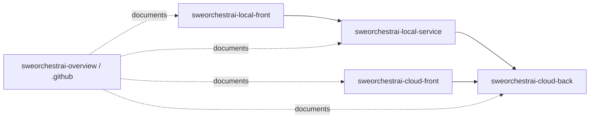

# Repository Overview

SWEOrchestrAI is organized as four MVP implementation repositories plus one overview/profile repository.

## Repository Map

| Repository | Purpose | Primary Dependencies |
|---|---|---|
| `sweorchestrai-local-front` | Local desktop UI for local project control, runs, logs, approvals, and provider visibility. | Depends on `sweorchestrai-local-service`. |
| `sweorchestrai-local-service` | Go local execution service for providers, repositories, MCP tools, local commands, and cloud sync. | Syncs with `sweorchestrai-cloud-back`. |
| `sweorchestrai-cloud-front` | Cloud project management UI for requirements, backlog, roadmap, diagrams, design stages, execution history, and visibility. | Depends on `sweorchestrai-cloud-back`. |
| `sweorchestrai-cloud-back` | Cloud backend monolith for auth, persistence, project logic, sync APIs, artifact metadata, and APIs for clients. | Owns cloud DB and object storage integration. |
| `sweorchestrai-overview` / `.github` | Documentation, architecture, roadmap, ADRs, organization README, and portfolio hub. | References all repositories. |

## Dependency Direction

## Source of Truth

| Concern | Owning Repository |
|---|---|
| Local desktop user experience | `sweorchestrai-local-front` |
| Local execution, providers, MCP tools, command safety | `sweorchestrai-local-service` |
| Cloud project management UI | `sweorchestrai-cloud-front` |
| Cloud APIs, persistence, auth, sync, artifacts | `sweorchestrai-cloud-back` |
| Product vision, docs, ADRs, roadmap, portfolio explanation | `sweorchestrai-overview` / `.github` |

## MVP Boundary

The overview/profile hub is intentionally separate from `sweorchestrai-cloud-front`.

The cloud frontend is only the cloud project management UI. It is not responsible for hosting portfolio documentation, architecture ADRs, organization profile content, or repository overview documentation.
